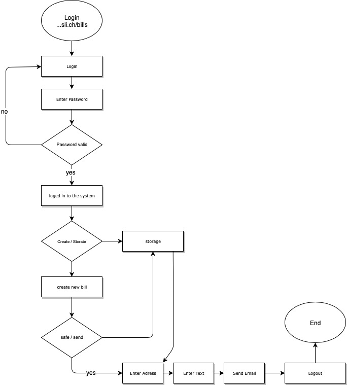

**Semsterarbeit PROG2**

**Projektidee:** Erstellen eines Horoskop,- Aszendenz,- Monzeichen-Rechners. Durch  diverse Eingaben der Nutzer, wird im Sinne einer Datingseite der perfekte Partner analysiert. Die Datingfunktion basiert auf Sternzeichenkunde und eigenen festgelegten Kriterien. Am Schluss des Semesters sollen meine Mitstudenten ihren Partner in der Klasse finden können. 

