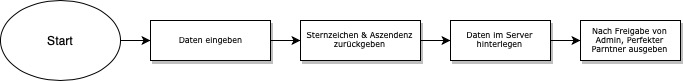

**Semsteraaarbeit PROG2**

## Ausgangslage
Studenten haben meistens und besonderns am Anfang des Studiums Probleme bei der Gruppenfindung für Projekte oder einen Lernpartner zu finden :alien: :purple_heart: :alien:. Dafür braucht es ein System bzw. eine Lustige Anwendung, welche auf Basis von wirklich wichtigen wie verlässlichen Daten :smirk:, eine Zuteilung machen kann. Oder wenigstens Anhaltspunkte dafür. Durch diverse Eingaben der Nutzer, wird im Sinne einer Datingseite der perfekte Partner :revolving_hearts: :collision: :revolving_hearts: analysiert. Die Datingfunktion basiert auf Sternzeichenkunde und eigenen festgelegten Kriterien. Am Schluss des Semesters sollen meine Mitstudenten ihren Partner in der Klasse finden können. 

## Funktion/Projektidee
Die Webapplikation teilt den eingetragenen Usern mit, welche Partner im Studium zu ihnen passen könnten. Studenten könnten ihre Daten hinterlassen und werden dann ahand von Sternzeichen einander zugeordnet. Dabei wird einem Studenten auch gleich die Kontaktdaten der potentiellen Partner ausgegeben. Die Applikation setzt sich aus drei Teilen zusammen. 

- Eingeben der Kontaktdaten
- Liste mit allen Teilnehmernn
- Matches anzeigen

## Anleitung/Workflow

1. Persönliche Daten eingeben (Finelove)
2. Alle eingetragenen Personen werden aufgelistet (All Lovers)
3. Die Matches können auch direkt angezeigt werden mit einem Klick (All Lvoers)
4. Die Matches einer Person werden direkt angezeigt (Your Destiny)

- Will sich eine Person neu Orientieren oder hat seine Matches vergessen, kann sie einfach ihre Mail eingeben und erhält die passenden Partner angezeigt.

